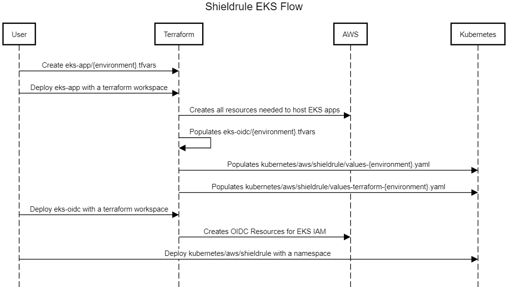

# Infrastructure readme

## Details
This stack uses Terraform 0.15.0 to launch all infrastructure resources needed to host the Shieldrule suite in ECS or EKS.
The major pieces this stack deploys per environment are:
- VPC / subnets / route tables / NAT gateway / internet gateway / ACLs
- ECS host autoscaling group
- Public-facing load balancer
- Optional ECS cluster
- ECS services for each app
- Route 53 DNS entries for each app


## Structure
TL;DR The `/app` directory will be your main focus. It houses all the important terroform files for managing your Modern Logic app's resources. The `/shared` directory manages ancillary dependencies for the app directory. These resources can be easily substituted for ones that your orginization already manages. The `/src` directory is only for modules used by the other two directories. You should never have to work directly with anything in this folder.

Here are the main directories and their purposes:
- `/shared` - hosts one-time resources that are shared across application deployments, such as AWS ECR repositories, optional Route53 resources, and an ECS service role.
You should never have to interact with this directory outside of a single one-time `terraform apply` at the beginning of your onboarding.
- `/ecs-app` - hosts the actual terraform you'll run `terraform apply` in to deploy the Modern Logic environment. This directory has *.tf files which handle all the resources required for Shieldrule. After a one-time deploy in `/shared`,
  you'll spend most of your time in this directory.
- `/eks-app` - an alternative to `ecs-app` for those who want to deploy EKS instead.
- `/eks-oidc` - used after `eks-app` is deployed to manage an IAM OIDC provider for an EKS cluster
- `/src` - contains terraform modules. This directory exists to create consistency among all terraform resources deployed, and is used by the `/ecs-app` and `elks-app` directories in the form of module calls.
You should never have to interact with this directory or any subdirectories inside it.


## One-time Prerequisites

### Deploying the shared stack
- Configure an AWS profile or credentials
- Copy `shared/sample.tfvars` to `shared/default.tfvars`
- Fill out variables in `shared/default.tfvars`
- `cd shared`
- `terraform apply --var-file=default.tfvars`

### Creating an AWS ACM certificate
This is done manually in order to allow you to use any DNS provider and verification method your team supports to create a certificate.

- Visit the AWS ACM dashboard and make a single certificate for the values `yourdomain.com` and `*.yourdomain.com`
- Validate the certificate any way you need


### Terraform Backend Configuration
- Fill out the `terraform.backend` section in `app/main.tf`, or otherwise set your preferred backend

## Creating a new environment
### ECS
#### Setup steps
- Copy `ecs-app/sample.tfvars` to `ecs-app/{environment}.tfvars` file, and fill in required values
- If you're not using Route 53, set `deploy_route53_resources = false` in `app/{environment}.tfvars`
- Create a `{company}-services-{environment}.pem` key pair in AWS in the desired region
- `cd ecs-app`
- Deploy:
  ```
  terraform workspace new {env}
  terraform init
  terraform apply --var-file={env}.tfvars
  ```

### Common adjustments
- To adjust the minimum or maximum amount of host servers available, set the variables for minimum_host_count or maximum_host_count. The defaults are 1 and 5, respectively.
- To adjust the default amount of tasks available to your services, adjust the desired_task_count_api, desired_task_count_web, or desired_task_count_docs variables.

### EKS
#### Setup
- Copy `ecs-app/sample.tfvars` to `eks-app/{environment}.tfvars` file, and fill in required values
- `cd eks-app`
- Deploy:
  ```
  terraform workspace new {env}
  terraform init
  terraform apply --var-file={env}.tfvars
  ```
- this stack will create all resources needed to host Shieldrule in EKS, and then output required values to both `kubernetes/aws/shieldrule` and `terraform/eks-app` to simplify deployments in those stacks
- `cd ../eks-oidc`
- Deploy:
  ```
  terraform workspace new {env}
  terraform init
  terraform apply --var-file={env}.tfvars
  ```

